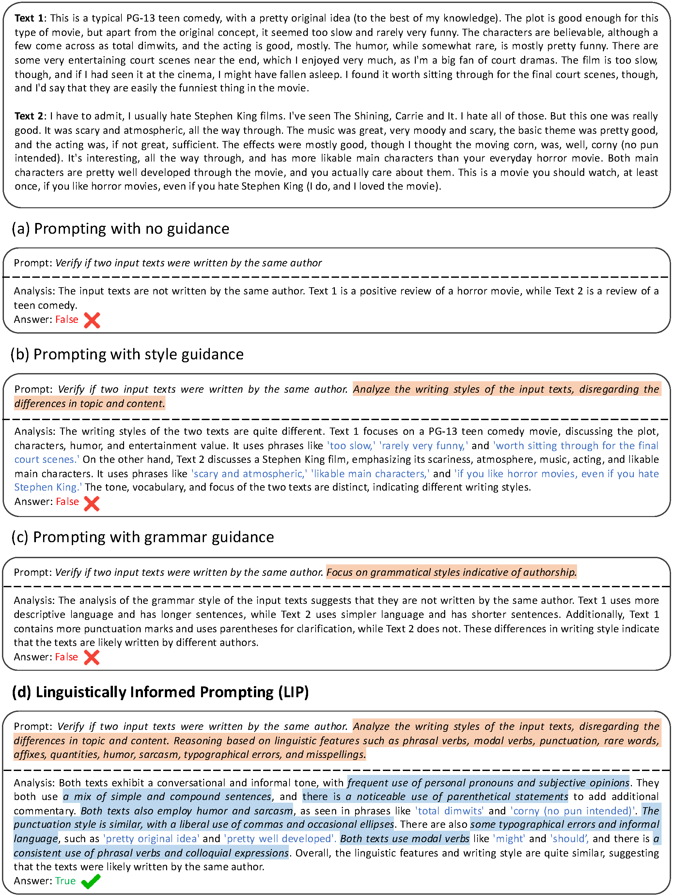

# Can Large Language Models Identify Authorship?

- **Overview**: This repo contains the code, results and data used in EMNLP 2024 Findings paper titled "Can Large Language Models Identify Authorship?" 

- **TLDR**: We propose Linguistically Informed Prompting (LIP) strategy, which offers in-context linguistic guidance, to boost LLMs' reasoning capacity for <i>authorship verification</i> and <i>attribution</i> tasks, while also providing natural language explanations.


- [[arXiv]](https://arxiv.org/pdf/2403.08213) [[Project Website]](https://llm-authorship.github.io/#canllm-identify-authorship)

This work focuses on exploring the capabilities of Large Language Models (LLMs) in authorship analysis tasks, specifically authorship verification and authorship attribution. The primary aim is to investigate whether LLMs can accurately identify the authorship of texts, which is pivotal for verifying content authenticity and mitigating misinformation.\


A Comparison Between <b>Linguistically Informed Prompting (LIP)</b> and other Prompting Strategies for Authorship Verification. 
"Analysis" and "Answer" are the output of prompting GPT-4. Only <b>LIP</b> strategy correctly identifies that the given two texts 
belong to the same author. Text colored in <span style="background-color: rgb(255, 204, 168);">orange</span> highlights the differences compared to vanilla prompting with no guidance. 
Text colored in <span style="color: rgb(68, 163, 247);">Blue</span> indicates the linguistically informed reasoning process. <span style="background-color: rgb(212, 235, 255);">Blue</span> text represents the text referenced from 
the original documents.



## BibTex
```
@inproceedings{huang2024authorship,
    title = "Can Large Language Models Identify Authorship?",
    author = "Huang, Baixiang  and  Chen, Canyu  and  Shu, Kai",
    editor = "Al-Onaizan, Yaser  and  Bansal, Mohit  and  Chen, Yun-Nung",
    booktitle = "Findings of the Association for Computational Linguistics: EMNLP 2024",
    month = nov,
    year = "2024",
    address = "Miami, Florida, USA",
    publisher = "Association for Computational Linguistics",
    url = "https://aclanthology.org/2024.findings-emnlp.26/",
    doi = "10.18653/v1/2024.findings-emnlp.26",
    pages = "445--460",
    abstract = "The ability to accurately identify authorship is crucial for verifying content authenticity and mitigating misinformation. Large Language Models (LLMs) have demonstrated exceptional capacity for reasoning and problem-solving. However, their potential in authorship analysis remains under-explored. Traditional studies have depended on hand-crafted stylistic features, whereas state-of-the-art approaches leverage text embeddings from pre-trained language models. These methods, which typically require fine-tuning on labeled data, often suffer from performance degradation in cross-domain applications and provide limited explainability. This work seeks to address three research questions: (1) Can LLMs perform zero-shot, end-to-end authorship verification effectively? (2) Are LLMs capable of accurately attributing authorship among multiple candidates authors (e.g., 10 and 20)? (3) Can LLMs provide explainability in authorship analysis, particularly through the role of linguistic features? Moreover, we investigate the integration of explicit linguistic features to guide LLMs in their reasoning processes. Our assessment demonstrates LLMs' proficiency in both tasks without the need for domain-specific fine-tuning, providing explanations into their decision making via a detailed analysis of linguistic features. This establishes a new benchmark for future research on LLM-based authorship analysis."
}
```
<!-- @artile{huang2024authorship,
    title   = {Can Large Language Models Identify Authorship?}, 
    author  = {Baixiang Huang and Canyu Chen and Kai Shu},
    year    = {2024},
    journal = {arXiv preprint},
    volume  = {abs/2403.08213},
    url     = {https://arxiv.org/abs/2403.08213}, 
} -->

## Methodology
Traditional authorship analysis methods rely on hand-crafted writing style features and classifiers, while state-of-the-art approaches utilize text embeddings from pre-trained language models, often requiring domain-specific fine-tuning. Our approach evaluates LLMs' performance in authorship analysis without the need for fine-tuning, and explores the integration of explicit linguistic features to enhance reasoning capabilities.

## Data Preprocessing
For this study, texts and authors were filtered to remove duplicates and authors contributing fewer than two texts. Non-English texts were excluded using the `py3langid` tool, available at [py3langid GitHub](https://github.com/adbar/py3langid).

## Datasets
The datasets used in this research are publicly available on Kaggle:
- Enron Email Dataset: [Access Here](https://www.kaggle.com/datasets/wcukierski/enron-email-dataset)
- Blog Authorship Corpus: [Access Here](https://www.kaggle.com/datasets/rtatman/blog-authorship-corpus)

## Code
The code accompanying this research is structured to facilitate the replication of our study and further exploration of LLMs in authorship analysis tasks. It includes scripts for data preprocessing and evaluation.


